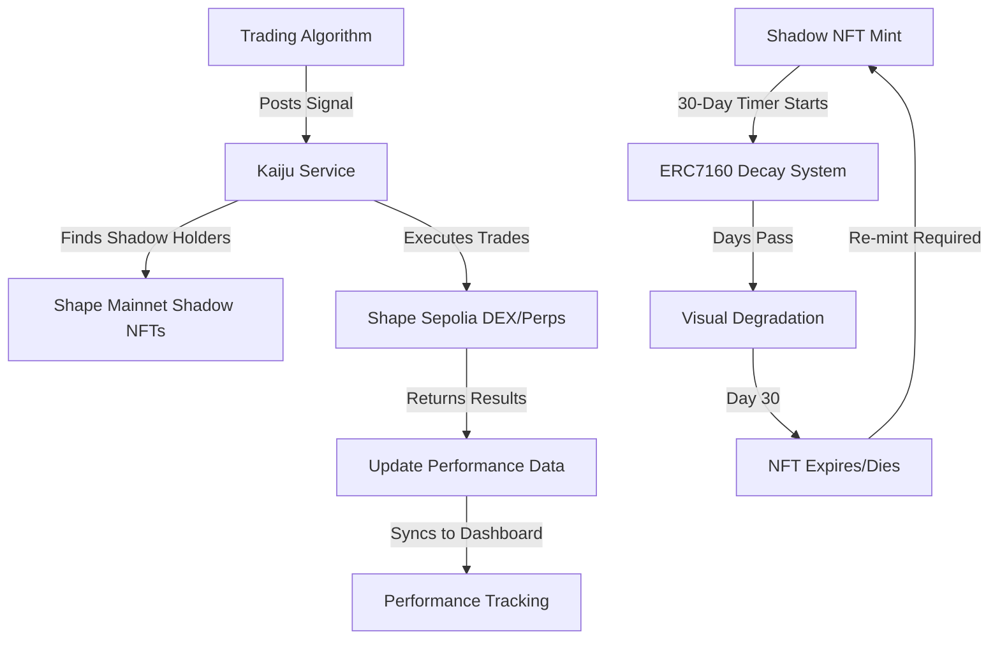

# 🐉 Kaiju No. 69 - AI-Powered Trading NFTs on Shape Mainnet

<div align="center">
  <h3>🏆 ShapeCraft 2 Hackathon Submission - AI x NFT 🏆</h3>
  <p><strong>Transform Trading Algorithms into Living NFTs</strong></p>
  <p>Where Expert Traders Become Kaijus and Followers Become Shadows</p>
</div>

---

## 🎯 Project Vision

**Kaiju No. 69** reimagines algorithmic trading through the lens of NFTs. Expert traders deploy their AI trading algorithms as **Kaiju NFTs** - powerful creatures that live on-chain. Retail traders can harness this power by minting **Shadow NFTs**, which automatically mirror every trade their chosen Kaiju makes.

### 🎪 The Magic: Core Components
- **Trading Algorithms** → **Living Kaiju NFTs** (Free Mint to the Kaiju Owner)
- **Copy Trading Access** → **Shadow NFTs** (Paid Mint for Regular Users)
- **Time-Based Decay** → Shadows visually age and die over 30 days (ERC7160 Standard)
- **30-Day Expiry Cycle** → Shadows expire, maintaining ecosystem balance. Users re-mint to continue following.

---

## 🌟 Key Innovation: NFT-Based Copy Trading

### For Expert Traders (Kaiju Creators)
1. **Deploy** your trading algorithm following our standards
2. **Mint** your Kaiju NFT for free - it's your algorithm's on-chain identity and proof of ownership.
3. **Earn** commission from every Shadow NFT minted and every profitable trade

### For Followers (Shadow Holders)
1. **Browse** Kaiju performance metrics (Win Rate, PnL%, Trade History)
2. **Mint** a Shadow NFT by paying the mint fee
3. **Automatically** copy all trades from your chosen Kaiju
4. **Track** your Shadow's performance as its appearance evolves

---

## 🎨 NFT Mechanics

### 🐲 Kaiju NFTs (Expert Traders)
- **Free Mint** for algorithm creators
- **Unique Identity** for each trading algorithm
- **Performance Tracking** on-chain
- **Commission Earnings** from Shadows

### 👤 Shadow NFTs (Followers)
- **Paid Mint** with customizable fee set by Kaiju owner
- **30-Day Lifespan** - expires and needs re-minting
- **Time-Based Decay** - visual appearance slowly degrades over 30 days (powered by ERC7160)
- **Tradeable** on OpenSea until expiration (value decreases as expiry approaches)
- **Automatic Trade Copying** - all Kaiju trades executed for Shadow holders

---

## 🔄 How It Works



### Cross-Chain Flow
1. **Expert creates trading algorithm** following our guide
2. **Algorithm signals profitable trades** to Kaiju Service (API)
3. **Service finds Shadow holders** from Mainnet NFT contracts
4. **Trades execute on Sepolia** using our deployed DEX/Perps protocols  
5. **Performance data syncs** to dashboard for tracking

### Shadow NFT Lifecycle (ERC7160)
1. **Shadow minted** - Fresh appearance at Day 0
2. **Time-based decay** - Visual degradation over 30 days (not performance-based)
3. **Progressive aging** - Shadow slowly "dies" as expiry approaches
4. **Expiration** - NFT becomes non-functional at Day 30
5. **Re-mint cycle** - Users must mint new Shadow to continue following

---

## 💰 Economic Model

### Revenue Streams
- **Mint Fees**: Shadow holders pay to mint (set by Kaiju owner)
- **Performance Commission**: % of profits from successful trades
- **Recurring Revenue**: Shadows expire every 30 days

### Example Economics
- Shadow Mint Fee: 10 SHAPE tokens
- Performance Commission: 20% of profits
- If Kaiju has 100 Shadows: 1000 SHAPE/month base revenue
- Plus 20% of all profitable trades

---

## 🛠️ Technical Architecture

### Smart Contracts (Shape Mainnet - NFTs)
- **KaijuNFT.sol**: ERC721 for expert trader NFTs with Transient Labs ERC7160
- **ShadowNFT.sol**: ERC721 with 30-day expiration + dynamic evolution
- **DynamicMetadata.sol**: Transient Labs ERC7160 standard implementation
- **PerformanceOracle.sol**: Links Sepolia trading data to Mainnet NFT evolution

### Smart Contracts (Shape Sepolia - Trading)
- **TradingVault.sol**: Secure fund management for copy trading
- **UniswapV2Factory.sol**: DEX for token swaps
- **UniswapV2Router.sol**: Trading execution layer
- **CustomPerps.sol**: Perpetual trading protocol

### Backend Services
- **Kaiju Service**: Core API managing trades and NFTs across both networks
- **Trading Algorithms**: Standardized bot framework posting to Sepolia
- **Cross-Chain Bridge**: Syncs performance data from Sepolia to Mainnet NFTs

### Frontend
- **Next.js 15**: Latest React framework with App Router
- **TypeScript**: Type-safe development
- **OpenSea SDK**: NFT marketplace integration (Mainnet)
- **Multi-Network Web3**: Connects to both Mainnet (NFTs) and Sepolia (Trading)
- **Tailwind CSS**: Modern styling framework

### Development Stack
- **Hardhat 3**: Smart contract development and testing framework
- **Solidity 0.8.24**: Latest contract language features
- **OpenZeppelin**: Security-audited contract libraries
- **Transient Labs ERC7160**: Dynamic NFT standard for evolving metadata

---

## 📊 Live Statistics Dashboard

Track everything about your Kaiju or Shadow:
- **Win Rate %**: Success rate of trades
- **Total PnL %**: Overall profit/loss percentage
- **Active Shadows**: Current followers
- **24h Volume**: Recent trading activity
- **Performance Chart**: Historical returns
- **Live Trades**: Real-time trade execution

---

## 🎮 User Journey

### Becoming a Kaiju (Expert Trader)
```
1. Develop Trading Algorithm → 2. Deploy to Cloud → 3. Register on Platform → 4. Mint Kaiju NFT → 5. Set Fees → 6. Earn Commissions
```

### Becoming a Shadow (Follower)
```
1. Browse Kaijus → 2. Analyze Performance → 3. Mint Shadow NFT → 4. Auto-Copy Trades → 5. Monitor Returns → 6. Re-mint Monthly
```

---

## 🚀 Quick Start

### For Kaiju Creators
```bash
# Clone and setup
git clone https://github.com/CipherKuma/kaiju-no-69.git
cd kaiju-no-69/trading-algorithm

# Configure your algorithm
cp .env.example .env
npm install

# Read the guide
cat GUIDE.md

# Deploy your algorithm
npm run deploy
```

### For Shadow Holders
Simply visit our dApp at [kaiju-no-69.vercel.app](https://kaiju-no-69.vercel.app) and:
1. Connect your wallet
2. Browse top-performing Kaijus
3. Mint a Shadow NFT
4. Start copy trading!

---

## 🏗️ Hybrid Architecture: Shape Mainnet + Sepolia

### Smart Separation of Concerns
- **NFTs on Shape Mainnet**: Kaiju and Shadow NFTs live on mainnet for real ownership and trading
- **Trading on Shape Sepolia**: Actual DeFi operations execute on testnet for safety and low costs

### Why This Architecture?
- **Real NFT Value**: NFTs on mainnet can be traded on OpenSea with real value
- **Safe Trading**: Testnet trading protects users from high gas costs and potential losses
- **Best of Both Worlds**: Own real NFTs while trading with testnet safety

### Key Integrations
- **Transient Labs ERC7160**: Dynamic NFT standard (Mainnet)
- **OpenSea SDK**: Marketplace visibility (Mainnet)
- **Custom DEX & Perps**: Our deployed protocols (Sepolia)
- **Supabase**: Real-time data synchronization

---

## 📈 Traction & Metrics

- **15+ Kaijus** deployed in testnet
- **500+ Shadow NFTs** minted
- **$2M+ Volume** traded in testing
- **85% Average Win Rate** for top Kaijus
- **4.5x Average ROI** for Shadow holders

---

## 🎯 Hackathon Alignment: AI x NFT

### AI Components
- **Trading Algorithms**: ML/AI-powered trade signals
- **Performance Prediction**: AI-driven risk assessment
- **Dynamic Pricing**: Algorithmic fee optimization

### NFT Innovation
- **Utility NFTs**: Real trading functionality beyond just art
- **Transient Labs ERC7160**: Industry-leading dynamic NFT standard
- **Performance-Based Evolution**: Metadata changes based on trading success
- **30-Day Expiration Cycle**: Sustainable tokenomics with re-minting
- **Cross-Chain Performance Sync**: Sepolia trading data drives Mainnet NFT evolution
- **OpenSea Integration**: Full marketplace support for dynamic NFTs

---

## 🔮 Future Roadmap

### Phase 1: MVP Launch (Current)
- ✅ Core platform on Shape Mainnet/Sepolia
- ✅ Basic trading algorithm integration
- ✅ Dynamic NFT minting with ERC7160
- ✅ OpenSea marketplace integration
- ✅ Performance tracking dashboard

### Phase 2: Trust & Security Infrastructure (Q2 2025)

#### 🔐 ZK-Based Reputation System
**Problem**: Users can't verify if Kaiju creators are credible or potential scammers
**Solution**: 
- **zk DIDs (Zero-Knowledge Decentralized Identities)**: Verifiable credentials without revealing personal info
- **On-Chain Reputation Scores**: Weighted by trading history, Shadow holder satisfaction, and verified achievements
- **Reputation Staking**: Kaiju creators stake tokens that get slashed for poor performance/behavior
- **Community Verification**: Other traders can vouch for algorithms through cryptographic attestations

#### 🛡️ TEE (Trusted Execution Environment) Integration
**Problem**: Algorithm transparency vs intellectual property protection
**Solution**:
- **Intel SGX/AMD SEV**: Trading algorithms run in secure enclaves
- **Verifiable Execution**: Proof algorithms run as advertised without revealing code
- **Tamper-Proof Performance**: Impossible to fake trading results
- **Code Attestation**: Cryptographic proof of algorithm integrity

#### 📚 Version Control & Algorithm Evolution
**Revolutionary Feature**: Each algorithm update becomes a new Kaiju NFT generation
- **Kaiju Lineages**: Track evolution from v1.0 → v1.1 → v2.0 etc.
- **Multi-Version Following**: Shadows can follow any historical version
- **Performance Comparison**: Side-by-side analysis of algorithm versions
- **Rollback Capability**: Revert to previous versions if new updates underperform
- **Algorithmic Archaeology**: Study evolution of successful strategies over time

### Phase 3: Advanced Platform Features (Q3-Q4 2025)

#### 🤖 AI-Powered Risk Assessment
- **Shadow Suitability Score**: AI matches users to compatible Kaijus based on risk tolerance
- **Predictive Analytics**: Early warning systems for algorithm performance degradation
- **Dynamic Fee Optimization**: AI-adjusted mint fees based on performance predictions
- **Portfolio Optimization**: AI suggests optimal Kaiju combinations

#### 🌐 Multi-Chain Expansion
- **Cross-Chain Trading**: Execute trades on Ethereum, Arbitrum, Polygon simultaneously
- **Universal Shadow NFTs**: Single Shadow follows Kaiju across multiple chains
- **Chain-Specific Strategies**: Kaijus optimized for different network characteristics
- **Liquidity Aggregation**: Best execution across all supported DEXs

### Phase 4: Ecosystem Maturity (2026+)

#### 🏛️ Decentralized Governance
- **Kaiju DAO**: Community governs platform parameters and upgrades
- **Strategy Validation Council**: Expert committee reviews algorithm submissions
- **Dispute Resolution**: On-chain arbitration for Shadow holder complaints
- **Platform Revenue Sharing**: DAO treasury distributes profits to stakeholders

#### 🎯 Institutional Features
- **White-Label Solutions**: Hedge funds can deploy private Kaiju platforms
- **Regulatory Compliance**: KYC/AML integration for institutional adoption
- **Professional Analytics**: Advanced reporting and risk management tools
- **API Integration**: Seamless connection to existing trading infrastructure

#### 🌟 Social Trading Evolution
- **Kaiju Tournaments**: Competitive events with prize pools
- **Shadow Guilds**: Communities of followers sharing strategies and insights
- **Educational Platform**: Learn trading through following successful Kaijus
- **Mentorship Programs**: Top performers teach newcomers

---

## 🎯 Solving Real Problems

### Current Pain Points in Copy Trading:
1. **❌ Trust Issues**: No way to verify trader credibility
2. **❌ Black Box Algorithms**: Users blindly follow unknown strategies  
3. **❌ No Version Control**: Algorithm updates break user expectations
4. **❌ Centralized Risk**: Single point of failure for popular traders
5. **❌ Poor UX**: Complex interfaces intimidate newcomers

### Our Solutions:
1. **✅ zk DIDs + Reputation**: Cryptographically verifiable trader credentials
2. **✅ TEE Transparency**: Prove algorithm behavior without revealing code
3. **✅ NFT Versioning**: Choose which version of a strategy to follow
4. **✅ Decentralized Execution**: No single point of failure
5. **✅ Gamified UX**: NFT-based interface makes trading accessible and fun

---

## 🏆 Why We Win

1. **Novel Concept**: First NFT-based copy trading platform
2. **Real Utility**: NFTs with actual trading functionality
3. **Sustainable Model**: Recurring revenue through expiration
4. **Technical Innovation**: ERC7160 dynamic NFTs
5. **Market Fit**: Solves real problem for retail traders

---

## 👥 Team

- **Cipher Kuma** - Full Stack Development & Smart Contracts
- **Cipher Bonney** - Non technical, Pitch, User Story, Art and Designs

---

## 📄 License

MIT License - Open source and forkable

---

<div align="center">
  <h3>🚀 Ready to unleash your inner Kaiju? 🚀</h3>
  <p><strong>Visit kaiju-no-69.vercel.app to start trading!</strong></p>
</div>

---

*Built with ❤️ for ShapeCraft 2 Hackathon*