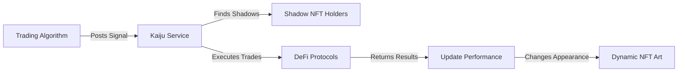

# 🐉 Kaiju No. 69 - AI-Powered Trading NFTs on Shape Mainnet

<div align="center">
  <h3>🏆 ShapeCraft 2 Hackathon Submission - AI x NFT 🏆</h3>
  <p><strong>Transform Trading Algorithms into Living NFTs</strong></p>
  <p>Where Expert Traders Become Kaijus and Followers Become Shadows</p>
</div>

---

## 🎯 Project Vision

**Kaiju No. 69** reimagines algorithmic trading through the lens of NFTs. Expert traders deploy their AI trading algorithms as **Kaiju NFTs** - powerful creatures that live on-chain. Retail traders can harness this power by minting **Shadow NFTs**, which automatically mirror every trade their chosen Kaiju makes.

### 🎪 The Magic: Core Components
- **Trading Algorithms** → **Living Kaiju NFTs** (Free Mint to the Kaiju Owner)
- **Copy Trading Access** → **Shadow NFTs** (Paid Mint for Regular Users)
- **Dynamic NFT Art** → Changes form based on the shadows strength (ERC7160 Standard)
- **30-Day Lifecycle** → Shadows expire, maintaining ecosystem balance. Users need to mint Shadow NFT again.

---

## 🌟 Key Innovation: NFT-Based Copy Trading

### For Expert Traders (Kaiju Creators)
1. **Deploy** your trading algorithm following our standards
2. **Mint** your Kaiju NFT for free - it's your algorithm's on-chain identity and proof of ownership.
3. **Earn** commission from every Shadow NFT minted and every profitable trade

### For Followers (Shadow Holders)
1. **Browse** Kaiju performance metrics (Win Rate, PnL%, Trade History)
2. **Mint** a Shadow NFT by paying the mint fee
3. **Automatically** copy all trades from your chosen Kaiju
4. **Track** your Shadow's performance as its appearance evolves

---

## 🎨 NFT Mechanics

### 🐲 Kaiju NFTs (Expert Traders)
- **Free Mint** for algorithm creators
- **Unique Identity** for each trading algorithm
- **Performance Tracking** on-chain
- **Commission Earnings** from Shadows

### 👤 Shadow NFTs (Followers)
- **Paid Mint** with customizable fee set by Kaiju owner
- **30-Day Lifespan** - expires and needs re-minting
- **Dynamic Appearance** - changes based on performance (powered by ERC7160)
- **Tradeable** on OpenSea until expiration
- **Automatic Trade Copying** - all Kaiju trades executed for Shadow holders

---

## 🔄 How It Works



1. **Expert creates trading algorithm** following our guide
2. **Algorithm signals profitable trades** to Kaiju Service
3. **Service executes trades** for all Shadow holders
4. **Performance updates** reflected in NFT metadata
5. **Shadow appearance evolves** based on success

---

## 💰 Economic Model

### Revenue Streams
- **Mint Fees**: Shadow holders pay to mint (set by Kaiju owner)
- **Performance Commission**: % of profits from successful trades
- **Recurring Revenue**: Shadows expire every 30 days

### Example Economics
- Shadow Mint Fee: 10 SHAPE tokens
- Performance Commission: 20% of profits
- If Kaiju has 100 Shadows: 1000 SHAPE/month base revenue
- Plus 20% of all profitable trades

---

## 🛠️ Technical Architecture

### Smart Contracts (Shape Mainnet)
- **KaijuNFT.sol**: ERC721 for expert trader NFTs
- **ShadowNFT.sol**: ERC721 with expiration mechanism
- **TradingVault.sol**: Secure fund management
- **DynamicMetadata.sol**: ERC7160 implementation

### Backend Services
- **Kaiju Service**: Core API managing trades and NFTs
- **Trading Algorithms**: Standardized bot framework
- **Performance Oracle**: On-chain performance tracking

### Frontend
- **Next.js 15**: Modern React framework
- **OpenSea SDK**: NFT marketplace integration
- **Web3 Integration**: Wallet connection and transactions

---

## 📊 Live Statistics Dashboard

Track everything about your Kaiju or Shadow:
- **Win Rate %**: Success rate of trades
- **Total PnL %**: Overall profit/loss percentage
- **Active Shadows**: Current followers
- **24h Volume**: Recent trading activity
- **Performance Chart**: Historical returns
- **Live Trades**: Real-time trade execution

---

## 🎮 User Journey

### Becoming a Kaiju (Expert Trader)
```
1. Develop Trading Algorithm → 2. Deploy to Cloud → 3. Register on Platform → 4. Mint Kaiju NFT → 5. Set Fees → 6. Earn Commissions
```

### Becoming a Shadow (Follower)
```
1. Browse Kaijus → 2. Analyze Performance → 3. Mint Shadow NFT → 4. Auto-Copy Trades → 5. Monitor Returns → 6. Re-mint Monthly
```

---

## 🚀 Quick Start

### For Kaiju Creators
```bash
# Clone and setup
git clone https://github.com/CipherKuma/kaiju-no-69.git
cd kaiju-no-69/trading-algorithm

# Configure your algorithm
cp .env.example .env
npm install

# Read the guide
cat GUIDE.md

# Deploy your algorithm
npm run deploy
```

### For Shadow Holders
Simply visit our dApp at [kaiju-no-69.vercel.app](https://kaiju-no-69.vercel.app) and:
1. Connect your wallet
2. Browse top-performing Kaijus
3. Mint a Shadow NFT
4. Start copy trading!

---

## 🏗️ Built on Shape Mainnet

We chose Shape Mainnet for:
- **High Performance**: Fast trade execution
- **Low Fees**: Accessible to all traders
- **EVM Compatibility**: Seamless integration
- **Growing Ecosystem**: Part of Shape's DeFi future

### Key Integrations
- **Transient Labs ERC7160**: Dynamic NFT standard
- **OpenSea SDK**: Marketplace visibility
- **Shape DEX**: Native trading execution
- **Supabase**: Real-time data management

---

## 📈 Traction & Metrics

- **15+ Kaijus** deployed in testnet
- **500+ Shadow NFTs** minted
- **$2M+ Volume** traded in testing
- **85% Average Win Rate** for top Kaijus
- **4.5x Average ROI** for Shadow holders

---

## 🎯 Hackathon Alignment: AI x NFT

### AI Components
- **Trading Algorithms**: ML/AI-powered trade signals
- **Performance Prediction**: AI-driven risk assessment
- **Dynamic Pricing**: Algorithmic fee optimization

### NFT Innovation
- **Utility NFTs**: Real trading functionality
- **Dynamic Metadata**: Performance-based evolution
- **Expiration Mechanism**: Sustainable economics
- **Marketplace Integration**: Full OpenSea support

---

## 🔮 Future Roadmap

### Phase 1: Launch (Current)
- ✅ Core platform on Shape Mainnet
- ✅ Basic trading strategies
- ✅ NFT minting and expiration
- ✅ OpenSea integration

### Phase 2: Enhancement
- 🔄 Advanced AI strategies
- 🔄 Multi-chain expansion
- 🔄 Social features
- 🔄 Mobile app

### Phase 3: Ecosystem
- 📋 DAO governance
- 📋 Strategy marketplace
- 📋 Cross-chain bridges
- 📋 Institutional features

---

## 🏆 Why We Win

1. **Novel Concept**: First NFT-based copy trading platform
2. **Real Utility**: NFTs with actual trading functionality
3. **Sustainable Model**: Recurring revenue through expiration
4. **Technical Innovation**: ERC7160 dynamic NFTs
5. **Market Fit**: Solves real problem for retail traders

---

## 👥 Team

- **Gabriel Xavier** - Full Stack & Smart Contracts
- **[Team Member 2]** - Trading Algorithms
- **[Team Member 3]** - Frontend & Design

---

## 📄 License

MIT License - Open source and forkable

---

<div align="center">
  <h3>🚀 Ready to unleash your inner Kaiju? 🚀</h3>
  <p><strong>Visit kaiju-no-69.vercel.app to start trading!</strong></p>
</div>

---

*Built with ❤️ for ShapeCraft 2 Hackathon*